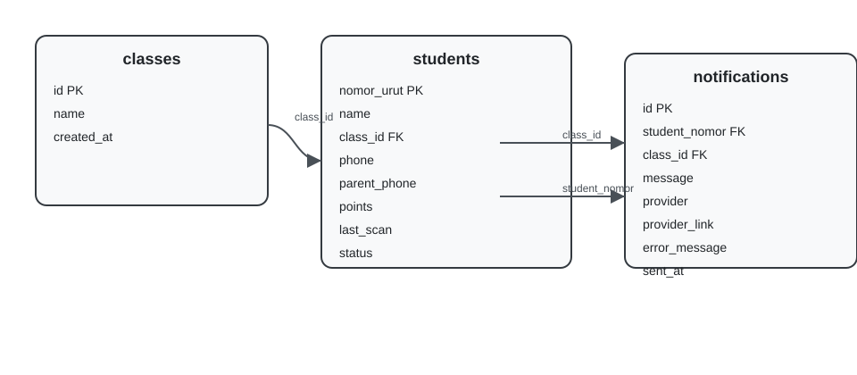

# Sistem Presensi Disiplin Siswa Berbasis QR Code

## 1. Ringkasan Sistem
Aplikasi ini adalah sistem presensi siswa berbasis QR Code yang dibangun di atas Node.js dan Express, menggunakan SQLite sebagai basis data lokal. Sistem dirancang untuk penggunaan sekolah dengan fitur administrasi, pemantauan realtime, laporan, validasi lokasi GPS, anti double-scan, sistem poin, dan integrasi WhatsApp untuk notifikasi keterlambatan.

### Komponen utama
- Backend: `Node.js` + `Express`
- Database: `SQLite` melalui package `sqlite3`
- Templating: `EJS`
- Frontend: Bootstrap 5, Bootstrap Icons
- Realtime: Socket.IO
- Grafik: Chart.js
- Export: ExcelJS, PDFKit
- QR Generator: `qrcode`

## 2. Fitur Utama

### 2.1. Autentikasi Admin
- Halaman login admin sederhana.
- Akses ke dashboard dan panel admin hanya setelah login.

### 2.2. Manajemen Kelas & QR
- Admin dapat melihat daftar kelas.
- Admin dapat membuat kelas baru.
- Admin dapat menghapus kelas.
- Untuk setiap kelas, sistem menghasilkan URL scan dan QR code yang dapat dipindai siswa.

### 2.3. Manajemen Data Siswa
- Admin dapat menambah, mengedit, dan menghapus data siswa.
- Data siswa mencakup:
  - Nama
  - Kelas
  - Nomor HP siswa
  - Nomor HP orang tua
  - Poin kedisiplinan
  - Status aktif
  - Status presensi terakhir

### 2.4. Halaman Scan QR untuk Siswa
- Siswa memindai QR kelas dan diarahkan ke halaman scan.
- Input yang diminta hanya `Nama Siswa`.
- Sistem otomatis menangkap lokasi GPS perangkat siswa.
- Validasi lokasi menggunakan radius 10 meter dari koordinat sekolah.

### 2.5. Alur Presensi
- Saat siswa mengisi nama dan lokasi tersedia, sistem mengecek:
  1. Apakah siswa sudah scan hari ini? (anti double-scan)
  2. Apakah lokasi berada dalam radius sekolah?
  3. Apakah waktu scan melewati batas `07:30`?
- Status scan ditentukan menjadi:
  - `Hadir` jika sebelum `07:30`
  - `Terlambat` jika setelah `07:30`

### 2.6. Sistem Poin
- Setiap scan `Hadir` menambah poin.
- Setiap scan `Terlambat` mengurangi poin.
- Poin disimpan di tabel siswa.

### 2.7. Export Laporan
- Export hasil data siswa ke Excel (`.xlsx`).
- Export laporan presensi ke PDF.

### 2.8. Monitoring dan Statistik
- Dashboard admin menampilkan kartu ringkasan utama:
  - Total Siswa Hadir hari ini
  - Total Siswa Terlambat hari ini
  - Belum Presensi hari ini
  - Total WhatsApp Terkirim hari ini
- Halaman monitoring khusus menampilkan grafik keterlambatan, ringkasan kelas, dan scan terakhir.

### 2.9. Pencarian Data Siswa
- Halaman `Data Siswa` memiliki fitur pencarian:
  - Filter berdasarkan nama siswa
  - Filter berdasarkan kelas

### 2.10. Status Notifikasi WhatsApp
- Halaman `Status Notifikasi` menampilkan log notifikasi terbaru.
- Menampilkan provider, tautan WA, dan error bila ada.

## 3. Alur Sistem

### 3.1. Alur Umum
1. Admin login ke sistem.
2. Admin membuat kelas dan melihat QR kelas.
3. Siswa memindai QR dan masuk ke halaman scan.
4. Sistem menangkap GPS dan memvalidasi lokasi.
5. Siswa memasukkan nama.
6. Sistem memproses presensi:
   - menandai `Hadir` atau `Terlambat`
   - memperbarui poin
   - memblokir scan ganda di hari yang sama
7. Jika `Terlambat`, sistem memicu notifikasi WhatsApp.
8. Admin melihat statistik dan log notifikasi.

### 3.2. Alur Notifikasi WhatsApp
1. Kondisi: siswa terdeteksi terlambat.
2. Fungsi `sendLateNotifications()` dipanggil.
3. Pesan dibangun untuk siswa dan orang tua.
4. Sistem mencoba mengirim melalui provider API nyata jika tersedia.
5. Jika tidak tersedia atau tidak dikonfigurasi, sistem membuat tautan `wa.me`.
6. Semua hasil dicatat ke tabel `notifications`.
7. Admin dapat memantau log pengiriman di halaman status notifikasi.

## 4. Integrasi WhatsApp

### 4.1. Mode WhatsApp
Sistem mendukung dua mode:
- **API WhatsApp nyata**
- **Fallback `wa.me`**

### 4.2. WhatsApp API Nyata
Jika sekolah memiliki layanan WhatsApp Business API atau WhatsApp Cloud API, sistem dapat dikonfigurasikan dengan dua environment variable:
- `WHATSAPP_API_URL`
- `WHATSAPP_API_TOKEN`

#### Cara kerjanya:
- Sistem mengirim request `POST` JSON ke `WHATSAPP_API_URL`.
- Header `Authorization: Bearer WHATSAPP_API_TOKEN` ditambahkan.
- Jika provider merespon sukses, catatan `provider = api` disimpan.
- Jika provider gagal, pesan error dicatat di `error_message`.

### 4.3. Fallback `wa.me`
Jika API nyata tidak tersedia, sistem otomatis mengubah nomor telepon menjadi format internasional Indonesia (`62...`) dan membentuk tautan:
- `https://wa.me/<nomor>?text=<pesan-terencode>`

Tautan tersebut:
- dicetak di log server
- dicatat sebagai `provider = wame`
- ditampilkan di halaman `Status Notifikasi`

### 4.4. WhatsApp disediakan oleh pihak sekolah
Sekolah harus menyiapkan salah satu dari:
- nomor WhatsApp bisnis yang terdaftar di WhatsApp Business API
- akses ke WhatsApp Business Cloud API
- layanan pihak ketiga (misalnya Twilio, WATI, Zoko, 360dialog, atau provider lokal lainnya)

Kemudian admin sekolah harus memasukkan URL dan token API ke environment aplikasi.

### 4.5. Langkah menambahkan konfigurasi WhatsApp
1. Dapatkan URL endpoint dari provider WhatsApp.
2. Dapatkan token Bearer dari provider yang valid.
3. Set environment variable pada server atau hosting platform:
   - `WHATSAPP_API_URL=https://example-provider.com/send`
   - `WHATSAPP_API_TOKEN=your_api_token_here`
4. Restart aplikasi.
5. Pastikan provider API dapat menerima payload JSON:
   - `{ "phone": "6281234...", "message": "..." }`

> Jika menggunakan hosting lokal, letakkan variabel ini di file environment atau panel konfigurasi layanan hosting.

## 5. Rincian Tabel Database

### 5.1. `classes`
- `id`
- `name`
- `created_at`

### 5.2. `students`
- `nomor_urut`
- `name`
- `class_id`
- `phone`
- `parent_phone`
- `points`
- `active`
- `last_scan`
- `status`
- `last_status_time`

### 5.3. `notifications`
- `id`
- `student_nomor`
- `class_id`
- `message`
- `provider`
- `provider_link`
- `error_message`
- `sent_at`

## 6. ERD (Entity Relationship Diagram)



```
+--------------+      +--------------+      +--------------------+
|   classes    |      |   students   |      |   notifications     |
+--------------+      +--------------+      +--------------------+
| id PK        |<---->| class_id FK  |      | id PK              |
| name         |      | nomor_urut PK|<---->| student_nomor FK    |
| created_at   |      | name         |      | class_id            |
+--------------+      | phone        |      | message             |
                      | parent_phone |      | provider            |
                      | points       |      | provider_link       |
                      | active       |      | error_message       |
                      | last_scan    |      | sent_at             |
                      | status       |      +--------------------+
                      | last_status_time |
                      +--------------+
```

### Hubungannya:
- `students.class_id` → `classes.id`
- `notifications.student_nomor` → `students.nomor_urut`
- `notifications.class_id` → `classes.id`

## 7. Rekomendasi Hosting

### Pilihan hosting terbaik
1. **VPS / Cloud VM** (DigitalOcean, Linode, AWS EC2, Azure VM)
   - Cocok karena SQLite memerlukan penyimpanan lokal yang persisten.
   - Memberikan kontrol penuh terhadap environment.
2. **Platform container** (Docker di VPS, Railway dengan volume persisten)
   - Ideal jika ingin menjalankan aplikasi dalam container.
3. **Platform PaaS Node.js** dengan volume persisten
   - Pastikan hosting menyediakan filesystem persistensi atau volume.

### Hosting yang direkomendasikan
- **DigitalOcean**: Droplet kecil (1 vCPU, 1GB RAM) sudah cukup
- **Railway**: Jika ada dukungan volume persisten untuk SQLite
- **Render**: Bisa dipakai dengan Docker + persistent disk
- **AWS Lightsail**: Murah, mudah mengelola server kecil

## 8. Langkah Hosting Sistem

### 8.1. Persiapan server
1. Siapkan server Linux (Ubuntu 22.04 atau sejenis).
2. Install Node.js (LTS) dan `npm`.
3. Pastikan `git` tersedia.
4. Jika ingin domain, siapkan DNS ke server.

### 8.2. Deploy kode
1. Clone repository ke server:
   ```bash
   git clone <repo-url> presensi-siswa
   cd presensi-siswa
   ```
2. Install dependencies:
   ```bash
   npm install
   ```
3. Buat file environment (jika perlu) atau set env vars di service hosting.
   ```bash
   export WHATSAPP_API_URL="https://provider.example/api/send"
   export WHATSAPP_API_TOKEN="your_token"
   export PORT=3000
   ```
4. Jalankan aplikasi:
   ```bash
   npm start
   ```

### 8.3. Menjalankan sebagai service
- Gunakan `pm2` atau `systemd` agar aplikasi tetap hidup.

#### Contoh `pm2`
```bash
npm install -g pm2
pm2 start server.js --name presensi-qr
pm2 save
pm2 startup
```

#### Contoh `systemd`
Buat file `/etc/systemd/system/presensi-qr.service`:
```ini
[Unit]
Description=Presensi QR Siswa
After=network.target

[Service]
Type=simple
User=ubuntu
WorkingDirectory=/home/ubuntu/presensi-siswa
ExecStart=/usr/bin/node /home/ubuntu/presensi-siswa/server.js
Restart=always
Environment=WHATSAPP_API_URL=https://provider.example/api/send
Environment=WHATSAPP_API_TOKEN=your_token
Environment=PORT=3000

[Install]
WantedBy=multi-user.target
```

Lalu jalankan:
```bash
sudo systemctl daemon-reload
sudo systemctl enable presensi-qr
sudo systemctl start presensi-qr
``` 

### 8.4. Mengamankan akses
- Pasang reverse proxy seperti Nginx jika gunakan domain.
- Aktifkan TLS/HTTPS dengan Let's Encrypt.
- Gunakan firewall untuk membatasi port hanya `80`, `443`, dan `3000` jika internal.

### 8.5. Backup dan data persistence
- Backup folder `data/` secara berkala karena `presensi.db` menyimpan semua data.
- Simpan file `views/`, `public/`, dan `server.js` di repository.

## 9. Penjelasan Detail Setiap Fitur

### 9.1. Scan QR
- QR yang dibuat berisi URL `http://<host>/scan/:classId`.
- Siswa memasukkan nama, sistem mencatat waktu, validasi GPS, dan memutuskan status.

### 9.2. Validasi GPS
- Lokasi sekolah dikodekan di `server.js`.
- Hitung jarak menggunakan rumus Haversine.
- Hanya izinkan scan jika jarak <= 10 meter.

### 9.3. Anti double-scan
- Cek apakah `last_scan` siswa pada hari yang sama sudah tercatat.
- Jika iya, tampilkan pesan error dan tolak scan kedua.

### 9.4. Export Excel / PDF
- Gunakan `ExcelJS` untuk laporan Excel.
- Gunakan `PDFKit` untuk PDF berisi ringkasan data siswa.

### 9.5. Monitoring & Grafik
- Halaman monitoring memuat grafik jumlah keterlambatan per kelas.
- Data diambil dari endpoint `GET /api/stats`.
- Socket.IO memicu refresh realtime ketika data berubah.

### 9.6. Pencarian siswa
- `GET /students` menerima query `name` dan `class_id`.
- Menampilkan hasil filter secara dinamis.

### 9.7. Status notifikasi
- Menyimpan log setiap pengiriman WA.
- Menampilkan ringkasan provider per hari.
- Mempermudah admin mengecek apakah notifikasi WA dikirim dengan benar.

## 10. Saran Pengembangan Selanjutnya
- Tambahkan validasi identitas siswa saat scan, misalnya `NIS` atau kode unik.
- Tambahkan laporan per kelas / per tanggal.
- Tambahkan otentikasi guru atau multiple admin.
- Tambahkan backup otomatis untuk database SQLite.
- Integrasikan email atau SMS sebagai kanal alternatif.

---

File dokumentasi ini bisa digunakan sebagai panduan teknis untuk pengembangan, pemeliharaan, dan deployment sistem.`}{